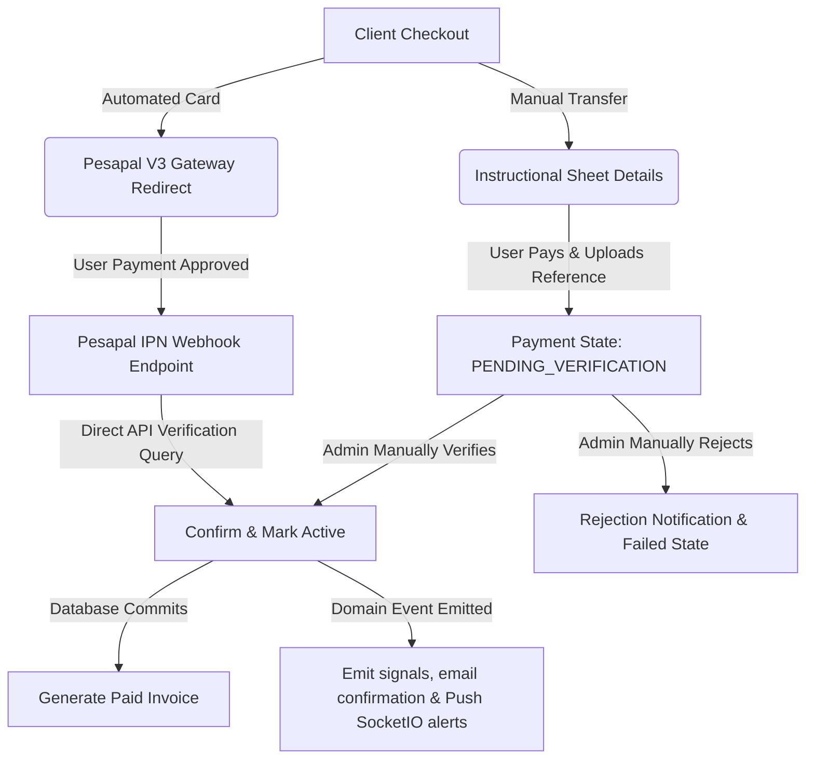

# Tuned Essays Payments Subsystem

Welcome to the Tuned Essays payment processing and billing module. This subsystem is a secure, highly robust, and hybrid billing pipeline supporting both **automated credit card transactions** (via Pesapal V3) and **manual administrator-verified payment proof uploads** (bank deposit, cash app, PayPal, etc.).

---

## 1. Subsystem Architecture Overview

The payment workflow spans custom database tables, transactional email dispatches, premium ReportLab PDF invoice generation, domain event triggers, and secure API endpoints.



### Supported Flow Transitions
1. **Pending (`PaymentStatus.PENDING`)**: Initial state when the checkout is created but payment is not yet initiated or verified.
2. **Pending Verification (`PaymentStatus.PENDING_VERIFICATION`)**: manual payment proof reference submitted by the client, waiting for administrator review.
3. **Completed (`PaymentStatus.COMPLETED`)**: Payment confirmed (either automatically via Pesapal's IPN or manually by an admin). Triggers `Order` activation to `OrderStatus.ACTIVE`, paid `Invoice` records generation, in-app notifications, and custom PDF emailing.
4. **Failed (`PaymentStatus.FAILED`)**: Set when an administrator rejects a manual payment proof or Pesapal reports a failed transaction.

---

## 2. API Endpoints Reference

The Payments API blueprint is registered under the `/api` prefix (resulting in `/api/payments/...` routes):

| HTTP Method | Route | Description | Authentication |
| :--- | :--- | :--- | :--- |
| **GET** | `/api/payments/methods` | Retrieve all active accepted payment methods (names and details). | Public |
| **POST** | `/api/payments/checkout` | Initiate checkout for an unpaid order. | Client |
| **GET** | `/api/payments/pesapal/ipn` | Secure Pesapal webhook listener (instant status checker integration). | Webhook (Public) |
| **POST** | `/api/payments/verify/<payment_id>` | Manually verify and approve a manual proof reference. | Admin Only |
| **POST** | `/api/payments/reject/<payment_id>` | Manually reject a manual proof reference with notes. | Admin Only |

### Webhook / IPN Idempotency & Security Guard
To prevent payload tampering or replay attacks, the `/api/payments/pesapal/ipn` listener **never** trusts parameters supplied in the request payload. Instead, it securely registers and queries the transaction's `OrderTrackingId` directly from the Pesapal transaction status endpoint to fetch the state from the source of truth.

---

## 3. Environment & Configuration Variables

Configure these settings in your `.env` configuration file:

```ini
# --- Pesapal Gateway Settings ---
PESAPAL_CONSUMER_KEY=your_pesapal_consumer_key
PESAPAL_CONSUMER_SECRET=your_pesapal_consumer_secret
PESAPAL_SANDBOX=True # Set to False for production
PESAPAL_IPN_URL=https://your-backend.com/api/payments/pesapal/ipn
PESAPAL_CALLBACK_URL=https://your-frontend.com/payments/callback
```

- **Authentication Cache**: Authentication credentials fetched from Pesapal are securely cached in-memory with automatic expiration offset buffers to avoid repeating authentication requests on every transaction.
- **IPN URL Deduplication**: The `PesapalHelper` automatically checks existing registered IPN URLs on the Pesapal merchant console to reuse them, avoiding hitting registration limits.

---

## 4. Email and PDF Billing Notifications

Payments automatically compile and send beautiful, fully responsive transactional HTML emails and styled PDFs using dynamic data:

1. **Email Templates (`tuned/templates/emails/`)**:
   - `client/payment_confirmed.html`: Transaction receipt sent to the client.
   - `client/payment_proof_submitted.html`: Proof submission acknowledgement.
   - `client/payment_rejected.html`: Alert details why manual proof was rejected.
   - `client/invoice_created.html`: Delivered paid invoice notifications with download links.
   - `admin/payment_proof_submitted.html`: Notification alerting active administrators to verify a pending proof.
2. **ReportLab PDF Services (`tuned/services/pdf_service.py`)**:
   - Creates crisp, branded, professional billing PDFs.
   - Features structured layout formats, tables, pricing grids, and letterhead headers.

---

## 5. Domain Events & Real-time Integration

Real-time push events and SocketIO notifications are handled through `tuned/interface/payment/events.py` event handlers:

- **SocketIO Signals**:
  - `dashboard:payment_updated`: Alerts client dashboard about payment state changes (pending, verified, or failed).
  - `admin:payment_verification_required`: Notifies admins in real-time about new manual proof verification queues.
- **In-App Notifications**: Automatically logs persistent, click-to-navigate in-app messages to client/admin drawers.

---

## 6. How to Run & Verify

### Running the Payment Unit Tests
A robust mock suite has been created to test the authentication caching, checkout redirections, client marks, and administrator workflows. Run:
```bash
PYTHONPATH=backend backend/venv/bin/python backend/tests/test_payments_workflow.py
```

### Initializing Database Seeds (Optional)
Make sure active accepted methods exist in your database table (`accepted_payment_method`) for clients to select them at checkout. Example seeds:
- `MethodCategory.CREDIT_CARD` (name: `"Card Payment via Pesapal"`, is_active: `True`)
- `MethodCategory.BANK_TRANSFER` (name: `"Direct Bank Deposit"`, details: `"Bank: Equity Bank\nAccount: 123456789\nName: Tuned Essays"`, is_active: `True`)
